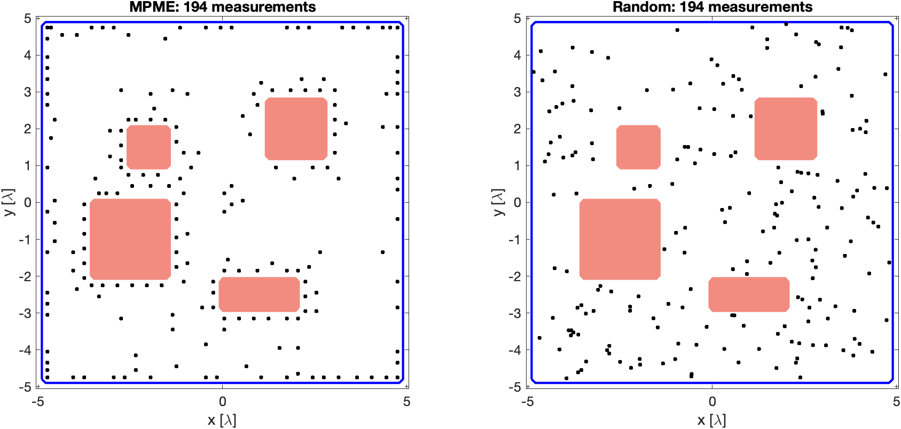
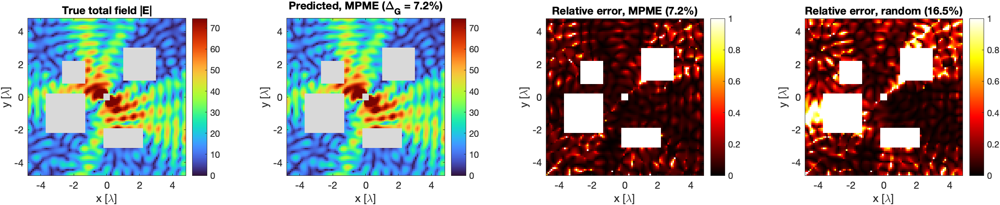

# Electromagnetic Field Imaging in Arbitrary Scattering Environments

MATLAB code for

> K. Sastry\*, C. Bhat\*, R. Solimene, and U. K. Khankhoje,
> **"Electromagnetic field imaging in arbitrary scattering environments,"**
> *IEEE Transactions on Computational Imaging*, vol. 7, pp. 224–233, 2021.
> [doi:10.1109/TCI.2021.3055982](https://doi.org/10.1109/TCI.2021.3055982)
> (\*equal contribution)

## The problem

Predict the electromagnetic field **everywhere** in an indoor environment (walls, furniture,
an unknown transmitter) from a **few** field measurements. Nothing is assumed about the
source or the materials: only the approximate shapes of the objects are known.
Two questions:

1. How do we reconstruct the total field from so little data?
2. **Where should the few sensors be placed?**

## Method

- **Formulation.** The total field is the incident field plus the field radiated by the
  tangential electric and magnetic fields on the object and wall surfaces (Huygens'
  principle). The unknown incident field is expanded with Graf's addition theorem into a
  few coefficients, and the extinction theorem gives consistency (state) equations. All of
  this needs only the free-space Green's function.
- **Sensor placement (MPME).** From a fine grid of candidate locations, select the rows of the
  propagator matrix with **Maximal Projection on Minimum Eigenspace**, after reducing it to
  its effective degrees of freedom.
- **Reconstruction (TCS-SOM).** Truncated SVD (Morozov's principle) for the well-determined
  part, then **ℓ1 minimisation in the DFT domain** (CVX) for the rest, subject to the data
  and state equations. The field anywhere follows from Huygens' principle.

## Results (paper setup: 10λ × 10λ room, 4 lossy objects + wall, 653 unknowns)

194 measurements (0.3 × the number of unknowns), 25 dB SNR:

**Sensor locations.** MPME places sensors along the object and wall boundaries, where the
near fields carry the most information; random sampling spreads them everywhere.



**True vs predicted total field, and relative error for both sampling schemes**



| Sampling | Tangential field error Δ_T | Field error Δ_G | Paper Δ_T / Δ_G (100 trials) |
|---|---|---|---|
| **MPME** | **18.4%** | **7.2%** | 19% / 8% |
| Random | 34.3% | 16.5% | 30% / 15% |

Choosing the sensor locations with MPME **halves the field-reconstruction error** for the
same number of measurements.

## Running

Requirements: MATLAB (tested with R2024a) and [CVX](http://cvxr.com/cvx) on the path.

```matlab
run_all      % about 7 minutes on a laptop; writes figures/
```

The whole method lives in `code/fmap_data_3.m`, organised in stages switched on by flags
(geometry, forward boundary-integral solver, true fields on a grid, inverse-problem
geometry, random or MPME sensor locations, TCS-SOM inverse solver, true tangential
fields, prediction matrix). `run_all.m` sets the flags for one MPME run and one
random-sampling run.

## Notes

- This is the research code used for the paper (framework by U. K. Khankhoje, extended by
  C. Bhat and K. Sastry), with small changes so that it runs end to end on a current MATLAB:
  - stage flags can be set by `run_all.m`;
  - noise is generated with base MATLAB instead of `awgn`;
  - `glquadrule.m` computes the Gauss–Legendre rule numerically instead of symbolically
    (same values, no Symbolic Math Toolbox needed);
  - the random-sampling branch uses total-field data with the approximate geometry, as the
    MPME branch does.
- `code/lgwt.m` is Greg von Winckel's Legendre–Gauss quadrature routine (MATLAB File Exchange).
- Numbers are from a single random instance; the paper averages 100 Monte Carlo trials.

## License

MIT, see [LICENSE](LICENSE). If you use this code, please cite the paper above.
